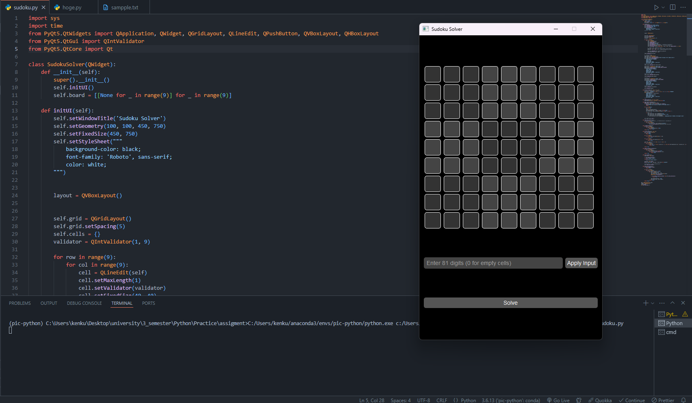
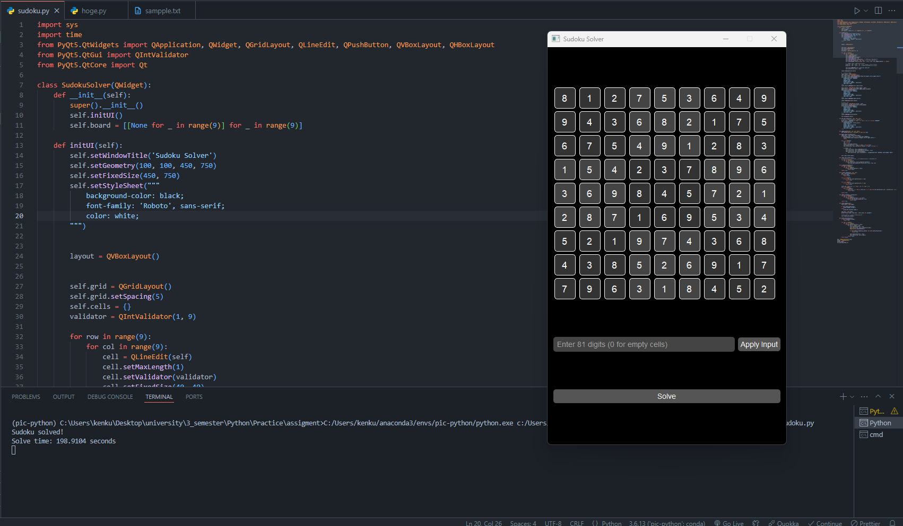

# Python Sudoku Solver

This project is a Python-based Sudoku solver that includes a GUI for user interaction and supports multiple solving algorithms.



## Components
- `Board` Class: Manages the Sudoku board.
- `Algorithm 1`: Basic backtracking algorithm for solving Sudoku.
- `Algorithm 2 (Optimised)`: An optimised version of the solving algorithm with heuristics for better performance.
- `SudokuSolverApp`: The main application class for the GUI.

## Board Class

### Constructor
Initialises a 9x9 Sudoku board with optional default values.

### Methods
- **Setter (`set_value`)**: Sets a value at a specific cell.
- **Getter (`get_value`)**: Retrieves the value at a specific cell.
- **`is_cell_valid`**: Checks if a specific cell value is valid based on Sudoku rules.
- **`is_board_filled`**: Verifies if all cells on the board are filled.

### `is_cell_valid` Method
The `is_cell_valid` method checks the validity of a cell based on three conditions:
1. **Row Check**: Ensures no duplicate numbers exist in the same row.
2. **Column Check**: Ensures no duplicate numbers exist in the same column.
3. **Box Check**: Ensures no duplicate numbers exist in the 3x3 sub-grid that contains the cell.

### `is_board_filled` Method
The `is_board_filled` method checks whether all cells in the board are filled with a valid number.

```python
class Board:
    def __init__(self):
        self.board = [[None for _ in range(9)] for _ in range(9)]

    def set_value(self, row, col, value):
        self.board[row][col] = value

    def get_value(self, row, col):
        return self.board[row][col]

    def is_cell_valid(self, row, col):
        num = self.get_value(row, col)
        if num is None:
            return False

        for i in range(9):
            if i != col and self.get_value(row, i) == num:
                return False

        for i in range(9):
            if i != row and self.get_value(i, col) == num:
                return False

        start_row, start_col = 3 * (row // 3), 3 * (col // 3)
        for i in range(3):
            for j in range(3):
                r = start_row + i
                c = start_col + j
                if (r != row or c != col) and self.get_value(r, c) == num:
                    return False

        return True

    def is_board_filled(self):
        for row in range(9):
            for col in range(9):
                if self.get_value(row, col) is None:
                    return False
        return True

```


## Algorithm 1

### Overview
`Algorithm 1` uses a brute force approach to solve the Sudoku puzzle. This algorithm iteratively tries to fill each empty cell with numbers from 1 to 9 and checks if the current board state is valid. The solution continues recursively until all cells are filled or it backtracks when no valid numbers can be placed in a cell.

### Methods
- **`solve`**: Calculates the time taken to solve the Sudoku puzzle by invoking the `solve_recursive` method. It returns a tuple indicating whether the puzzle was solved and the time taken to solve it.
- **`solve_recursive`**: The main brute force algorithm.
  - **Process**:
    1. Iterates over each cell in the 9x9 board.
    2. If a cell is empty (i.e., `None`), it tries placing numbers from 1 to 9 in the cell.
    3. After placing a number, the screen refreshes using the `QApplication.processEvents()` function to provide real-time feedback in the GUI.
    4. Checks the validity of the current board state using the `is_cell_valid` function.
    5. If valid, it proceeds recursively to the next cell.
    6. If no valid numbers can be placed in a cell, it resets the cell to `None`, clears the display, and backtracks to try the next possibility.
  - **Base Case**: If all cells are filled, the method returns `True` indicating that the puzzle is solved.

### Example Code Explanation
Here's how `Algorithm1Solver` works:

```python
class Algorithm1Solver:
    def __init__(self, board, cells):
        self.board = board  # Board object representing the current state of the Sudoku grid
        self.cells = cells  # Dictionary of QLineEdit widgets representing the GUI cells

    def solve(self):
        start_time = time.time()  # Record the start time
        solved = self.solve_recursive()  # Begin the recursive solving process
        end_time = time.time()  # Record the end time
        solve_time = end_time - start_time  # Calculate the total time taken
        return solved, solve_time  # Return the result and time taken

    def solve_recursive(self):
        for row in range(9):  # Iterate through each row
            for col in range(9):  # Iterate through each column
                if self.board.get_value(row, col) is None:  # Check if the cell is empty
                    for num in range(1, 10):  # Try numbers 1 to 9
                        self.board.set_value(row, col, num)  # Set the value in the board
                        self.cells[(row, col)].setText(str(num))  # Update the GUI
                        QApplication.processEvents()  # Refresh the GUI

                        if self.board.is_cell_valid(row, col) and self.solve_recursive():
                            return True  # Continue if valid and recursive call succeeds

                        self.board.set_value(row, col, None)  # Reset the cell if not valid
                        self.cells[(row, col)].clear()  # Clear the GUI cell
                    return False  # No valid numbers found, backtrack
        return True  # All cells are filled, puzzle is solved
```
## Algorithm 2

### Overview
`Algorithm 2` is an optimized Sudoku-solving algorithm that uses a heuristic approach known as the **Minimum Remaining Value (MRV)**. This strategy improves upon the basic brute force method by selecting the cell with the fewest possible candidate numbers, reducing the number of recursive calls and overall search space. The solution is found using backtracking with MRV, ensuring faster solving for more complex Sudoku puzzles.

### Methods
- **`solve`**: Measures the time taken to solve the Sudoku puzzle by invoking the `solve_recursive` method. It returns a tuple indicating whether the puzzle was solved and the time taken to solve it.
- **`solve_recursive`**: The main recursive algorithm that uses the MRV heuristic.
  - **Process**:
    1. Calls `find_next_cell` to select the cell with the fewest candidate numbers.
    2. If no empty cells are left, the method returns `True`, indicating the puzzle is solved.
    3. Tries each candidate number in the selected cell.
    4. Updates the GUI using `QApplication.processEvents()` to show the real-time solving process.
    5. Recursively calls `solve_recursive` for the next cell.
    6. If a number doesn't lead to a solution, resets the cell to `None`, clears the display, and backtracks to try the next candidate.
  - **Base Case**: If all cells are filled, the method returns `True`, signaling that the puzzle is successfully solved.

- **`find_next_cell`**: Finds the next cell to try by selecting the one with the minimum number of candidates (MRV). This heuristic reduces the number of choices and makes the algorithm more efficient.
  - **Process**:
    1. Iterates over each empty cell in the 9x9 grid.
    2. Calculates the number of candidates for each cell.
    3. Selects the cell with the fewest candidates.
    4. Returns the cell and its candidate numbers.

- **`get_candidates`**: Determines the valid numbers for a specific cell.
  - **Process**:
    1. Collects numbers already used in the same row, column, and 3x3 block.
    2. Returns the set of numbers from 1 to 9 that are not already used.

### Example Code Explanation
Here's how `Algorithm2Solver` works:

```python
class Algorithm2Solver:
    def __init__(self, board, cells):
        self.board = board  # Board object representing the current state of the Sudoku grid
        self.cells = cells  # Dictionary of QLineEdit widgets representing the GUI cells

    def solve(self):
        start_time = time.time()  # Record the start time
        solved = self.solve_recursive()  # Begin the recursive solving process
        end_time = time.time()  # Record the end time
        solve_time = end_time - start_time  # Calculate the total time taken
        return solved, solve_time  # Return the result and time taken

    def find_next_cell(self):
        min_candidates = 10  # Initialize with a number higher than the max possible candidates
        next_cell = None
        for row in range(9):
            for col in range(9):
                if self.board.get_value(row, col) is None:  # Check if the cell is empty
                    candidates = self.get_candidates(row, col)
                    if len(candidates) < min_candidates:
                        min_candidates = len(candidates)
                        next_cell = (row, col, candidates)
                    if min_candidates == 1:
                        return next_cell  # Early exit if a cell with only 1 candidate is found
        return next_cell

    def get_candidates(self, row, col):
        used_numbers = set()
        # Check row
        for c in range(9):
            num = self.board.get_value(row, c)
            if num:
                used_numbers.add(num)
        # Check column
        for r in range(9):
            num = self.board.get_value(r, col)
            if num:
                used_numbers.add(num)
        # Check 3x3 block
        start_row, start_col = 3 * (row // 3), 3 * (col // 3)
        for r in range(3):
            for c in range(3):
                num = self.board.get_value(start_row + r, start_col + c)
                if num:
                    used_numbers.add(num)
        return set(range(1, 10)) - used_numbers  # Return valid candidates

    def solve_recursive(self):
        cell = self.find_next_cell()
        if not cell:
            return True  # All cells are filled

        row, col, candidates = cell
        for num in candidates:
            self.board.set_value(row, col, num)
            self.cells[(row, col)].setText(str(num))
            QApplication.processEvents()  # Update GUI

            if self.solve_recursive():
                return True

            self.board.set_value(row, col, None)
            self.cells[(row, col)].clear()
        return False
```
## SudokuSolverApp Class

### Overview
`SudokuSolverApp` is the main class for the graphical user interface (GUI) of the Sudoku solver application. This class is responsible for initializing the UI, handling user interactions, and connecting with the solving algorithms (`Algorithm1Solver` and `Algorithm2Solver`). It provides users with the ability to input a Sudoku puzzle, apply the input to the board, and solve the puzzle using different solving strategies.

### Methods
- **`__init__`**: Initializes the `SudokuSolverApp` instance by setting up the `Board` object and calling `initUI` to build the interface.
- **`initUI`**: Creates and configures the GUI layout, including the Sudoku grid, input field, and buttons for interacting with the board.
- **`set_cell_style`**: Applies a visual style to the individual cells within the grid, including alternating background colors for the 3x3 subgrids.
- **`update_board`**: Updates the internal board model when the user inputs a number into a cell.
- **`apply_input_to_board`**: Takes a string input representing the initial Sudoku board and updates the GUI and internal model accordingly.
- **`solve_sudoku`**: Calls `Algorithm1Solver` to solve the Sudoku puzzle using a basic brute force approach and displays the time taken.
- **`solve_sudoku2`**: Calls `Algorithm2Solver`, which uses an optimized algorithm with the Minimum Remaining Value heuristic to solve the puzzle, and displays the time taken.

### Process Details
- **`initUI` Method**:
  1. Sets the window properties (title, size, and style).
  2. Initializes the 9x9 grid layout with `QLineEdit` widgets for user input, arranged with appropriate spacing.
  3. Adds input fields for bulk input and buttons for applying input and solving the puzzle.
  4. Includes buttons for two solving algorithms (`solve` and `solve_sudoku2`), allowing users to compare performance.

- **`apply_input_to_board` Method**:
  - Reads a string of 81 digits (representing the Sudoku board) from the input field.
  - Parses the string to update both the internal `Board` object and the visible cells in the grid.
  - Sets initial values as read-only and visually distinct with a different background color.

- **`solve_sudoku` and `solve_sudoku2` Methods**:
  - Each method calls its respective solver class (`Algorithm1Solver` or `Algorithm2Solver`) to find a solution.
  - Displays a message in the console indicating if the puzzle was solved and how long it took.

### Example Code Explanation
Here's how the `SudokuSolverApp` class is implemented:

```python
class SudokuSolverApp(QWidget):
    def __init__(self):
        super().__init__()
        self.board = Board()  # Board class instance
        self.initUI()  # Initialize the user interface

    def initUI(self):
        self.setWindowTitle('Sudoku Solver')
        self.setGeometry(100, 100, 450, 750)
        self.setFixedSize(450, 750)
        # Set general style for the window
        self.setStyleSheet("""
            background-color: black;
            font-family: 'Roboto', sans-serif;
            color: white;
        """)

        layout = QVBoxLayout()
        self.grid = QGridLayout()
        self.cells = {}
        validator = QIntValidator(1, 9)  # Validator to restrict input to digits 1-9

        # Create the 9x9 grid for input cells
        for row in range(9):
            for col in range(9):
                cell = QLineEdit(self)
                cell.setMaxLength(1)
                cell.setValidator(validator)
                cell.setFixedSize(40, 40)
                cell.setAlignment(Qt.AlignCenter)
                self.set_cell_style(cell, row, col)  # Apply cell style
                cell.textChanged.connect(lambda text, r=row, c=col: self.update_board(r, c, text))

                # Adjust cell placement to create spacing for 3x3 blocks
                grid_row = row + (row // 3)
                grid_col = col + (col // 3)
                self.grid.addWidget(cell, grid_row, grid_col)

                self.cells[(row, col)] = cell

        layout.addLayout(self.grid)

        # Add input field for bulk input
        input_layout = QHBoxLayout()
        self.input_field = QLineEdit(self)
        self.input_field.setPlaceholderText("Enter 81 digits (0 for empty cells)")
        self.input_field.setStyleSheet("""
            background-color: #444444; 
            color: white; 
            padding: 5px; 
            border-radius: 5px; 
            font-family: 'Roboto', sans-serif;
            font-size: 14px;
        """)
        input_layout.addWidget(self.input_field)

        # Add 'Apply Input' button
        apply_button = QPushButton('Apply Input', self)
        apply_button.clicked.connect(self.apply_input_to_board)
        apply_button.setStyleSheet("""
            background-color: #555555; 
            color: white; 
            padding: 5px; 
            border-radius: 5px;
            font-family: 'Roboto', sans-serif;
            font-size: 14px;
        """)
        input_layout.addWidget(apply_button)
        layout.addLayout(input_layout)

        # Add 'Solve' button for Algorithm 1
        solve_button = QPushButton('Solve', self)
        solve_button.clicked.connect(self.solve_sudoku)
        solve_button.setStyleSheet("""
            background-color: #555555; 
            color: white; 
            padding: 5px; 
            border-radius: 5px;
            font-family: 'Roboto', sans-serif;
            font-size: 14px;
        """)
        layout.addWidget(solve_button)

        # Add 'Optimize' button for Algorithm 2
        solve_button2 = QPushButton('Optimize', self)
        solve_button2.clicked.connect(self.solve_sudoku2)
        solve_button2.setStyleSheet("""
            background-color: #555555; 
            color: white; 
            padding: 5px; 
            border-radius: 5px;
            font-family: 'Roboto', sans-serif;
            font-size: 14px;
        """)
        layout.addWidget(solve_button2)

        self.setLayout(layout)

    def set_cell_style(self, cell, row, col):
        block_color = "#333333" if (row // 3 + col // 3) % 2 == 0 else "#444444"
        cell.setStyleSheet(f"""
            background-color: {block_color}; 
            color: white; 
            border: 1px solid white;
            border-radius: 5px;
            font-family: 'Roboto', sans-serif;
            font-size: 18px;
        """)

    def update_board(self, row, col, text):
        value = int(text) if text else None
        self.board.set_value(row, col, value)

    def apply_input_to_board(self):
        input_text = self.input_field.text()
        if len(input_text) != 81 or not input_text.isdigit():
            print("Please enter exactly 81 digits (0 for empty cells).")
            return

        for i in range(81):
            row = i // 9
            col = i % 9
            value = int(input_text[i])
            self.board.set_value(row, col, value if value != 0 else None)
            self.cells[(row, col)].setText(str(value) if value != 0 else '')

            if value != 0:
                self.cells[(row, col)].setReadOnly(True)
                self.cells[(row, col)].setStyleSheet(
                    self.cells[(row, col)].styleSheet() + "background-color: #222222; font-weight: bold;"
                )

        self.input_field.clear()

    def solve_sudoku(self):
        solver = Algorithm1Solver(self.board, self.cells)
        solved, solve_time = solver.solve()
        if solved:
            print(f"Sudoku solved in {solve_time:.4f} seconds")
        else:
            print("No solution found.")

    def solve_sudoku2(self):
        solver = Algorithm2Solver(self.board, self.cells)
        solved, solve_time = solver.solve()
        if solved:
            print(f"Sudoku solved in {solve_time:.4f} seconds")
        else:
            print("No solution found.")
```

